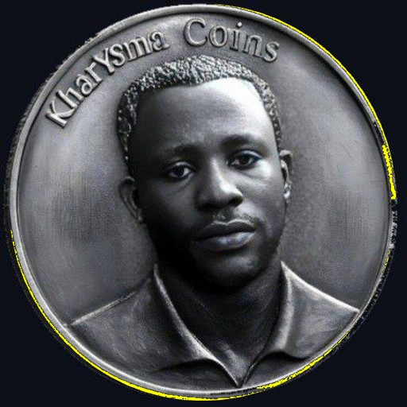

````md
# KHACN — KharYsma Coins

https://startarcoins.com">Website
https://etherscan.io/token/0x11c1b94294A7967092F747434dEE4876EcA5fD53">Etherscan
https://app.uniswap.org/explore/tokens/ethereum/0x11c1b94294A7967092F747434dEE4876EcA5fD53


---

## About KharYsma Coins

**KharYsma Coins (KHACN)** is an ERC-20 utility token developed by **Groupe Business Thérapie (GBT)**.

KHACN connects the creative universe of international artist **KharYsma Arafat NZABA** with blockchain technology. The project is designed to support a growing ecosystem combining digital art, music, paintings, books, audiovisual works, community experiences, and future Web3 services.

The purpose of KHACN is to create practical utility around creative assets while building an international digital ecosystem powered by Ethereum.

> **KHACN is the official token of the KharYsma ecosystem. Always verify the smart-contract address before interacting with any token or liquidity pool.**

---

## Official Token Information

| Item | Official Information |
|---|---|
| **Token name** | KharYsma Coins |
| **Ticker** | `KHACN` |
| **Standard** | ERC-20 |
| **Network** | Ethereum Mainnet |
| **Project developer** | Groupe Business Thérapie (GBT) |
| **Official website** | [startarcoins.com](https://startarcoins.com) |
| **Contract verification** | [View on Etherscan](https://etherscan.io/token/0x11c1b94294A7967092F747434dEE4876EcA5fD53) |

## Official Smart Contract

```text
0x11c1b94294A7967092F747434dEE4876EcA5fD53
````

> **Only trust this exact contract address for KHACN on Ethereum.**

---

## KHACN Ecosystem

| Area           | Purpose                                                                                       |
| -------------- | --------------------------------------------------------------------------------------------- |
| 🎵 Music       | Access, promotion, releases, royalties-oriented initiatives, and artist-community experiences |
| 🎨 Art         | Digital and physical artwork initiatives connected to blockchain utility                      |
| 📚 Publishing  | Books, literary projects, digital editions, and creative distribution                         |
| 🎬 Audiovisual | Films, videograms, visual content, and cultural projects                                      |
| 🌍 Community   | International community engagement and future Web3 experiences                                |
| ⚙️ Technology  | Blockchain-based utility, token integrations, and future decentralized services               |

---

# ⚠️ Official Security Notice

## 🇫🇷 COMMUNIQUÉ OFFICIEL — KHACN

Une erreur de manipulation lors d’une tentative de création d’enchère sur Uniswap a entraîné le déploiement accidentel d’un token distinct.

Ce token accidentel :

* ne représente **pas** KharYsma Coins ;
* n’est **pas affilié** au projet KHACN officiel ;
* ne doit pas être utilisé comme référence ;
* ne doit pas être acheté, échangé ou confondu avec le token officiel.

Le seul contrat officiel du token **KHACN — KharYsma Coins** sur Ethereum est :

```text
0x11c1b94294A7967092F747434dEE4876EcA5fD53
```

Avant toute transaction, vérifiez toujours l’adresse complète du smart contract.


```text
KHACN • ETH • USDT • STRB
```

Cette identité visuelle a été mise en place pour faciliter la reconnaissance du token authentique.

| Official Resource | Link                                                                                       |
| ----------------- | ------------------------------------------------------------------------------------------ |
| Website           | [https://startarcoins.com](https://startarcoins.com)                                       |
| Official Contract | [Etherscan — KHACN](https://etherscan.io/token/0x11c1b94294A7967092F747434dEE4876EcA5fD53) |
| Network           | Ethereum Mainnet                                                                           |

---

## 🇬🇧 OFFICIAL NOTICE — KHACN

A handling error during an Uniswap auction setup accidentally deployed a separate token contract.

This accidental token:

* is **not** KharYsma Coins;
* is **not affiliated** with the official KHACN project;
* must not be used as a reference;
* must not be bought, traded, or confused with the official token.

The only official **KHACN — KharYsma Coins** contract on Ethereum is:

```text
0x11c1b94294A7967092F747434dEE4876EcA5fD53
```

Always verify the complete smart-contract address before interacting with any token, pool, auction, or decentralized exchange.


```text
kharYsma Coins logo link 
```

This marker is intended to help the community identify the authentic token.

| Official Resource | Link                                                                                       |
| ----------------- | ------------------------------------------------------------------------------------------ |
| Website           | [https://startarcoins.com](https://startarcoins.com)                                       |
| Official Contract | [Etherscan — KHACN](https://etherscan.io/token/0x11c1b94294A7967092F747434dEE4876EcA5fD53) |
| Network           | Ethereum Mainnet                                                                           |

---

## Verification Checklist

Before buying, swapping, adding liquidity, or participating in an auction:

* [ ] Confirm the network is **Ethereum Mainnet**
* [ ] Confirm the token symbol is **KHACN**
* [ ] Confirm the contract address is exactly:

```text
0x11c1b94294A7967092F747434dEE4876EcA5fD53
```

* [ ] Verify the official website is [startarcoins.com](https://startarcoins.com)
* [ ] Verify the token on [Etherscan](https://etherscan.io/token/0x11c1b94294A7967092F747434dEE4876EcA5fD53)
* [ ] Do not rely only on a logo, token name, ticker, social-media post, or search result

---

## Disclaimer

KHACN is a blockchain-based utility token. Digital assets involve market, liquidity, technical, regulatory, and smart-contract risks. Nothing in this repository constitutes investment, legal, tax, or financial advice.

Users remain responsible for their own research, wallet security, transaction verification, and compliance with applicable laws.

---

<p align="center">
  <strong>KHACN • OFFICIAL • Ethereum Mainnet</strong><br />
  Built by Groupe Business Thérapie (GBT)
</p>
```

Email: contact@startarcoins.com / notairebtc@yahoo.fr / pro.nzaba@yahoo.fr

```md

```
