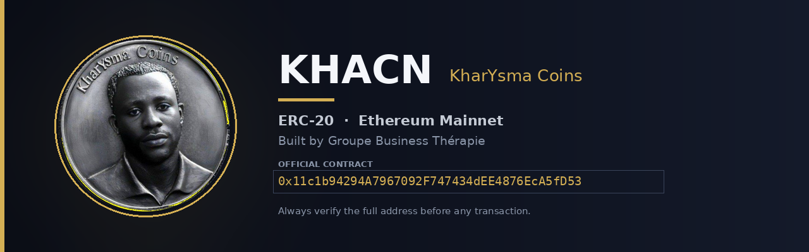

<p align="center">
  
</p>

<p align="center">
  <a href="https://startarcoins.com"></a>
  <a href="https://etherscan.io/token/0x11c1b94294A7967092F747434dEE4876EcA5fD53"></a>
  <a href="https://app.uniswap.org/explore/tokens/ethereum/0x11c1b94294A7967092F747434dEE4876EcA5fD53"></a>
  
</p>

# KHACN — KharYsma Coins

| Resource | Link |
|---|---|
| **Website** | [startarcoins.com](https://startarcoins.com) |
| **Etherscan** | [View token](https://etherscan.io/token/0x11c1b94294A7967092F747434dEE4876EcA5fD53) |
| **Token source code** | [Verified contract](https://etherscan.io/token/0x11c1b94294A7967092F747434dEE4876EcA5fD53#code) |
| **Uniswap** | [Token page](https://app.uniswap.org/explore/tokens/ethereum/0x11c1b94294A7967092F747434dEE4876EcA5fD53) |

---

## About KharYsma Coins

**KharYsma Coins (KHACN)** is an ERC-20 utility token developed by **Groupe Business Thérapie (GBT)**.

KHACN connects the creative universe of international artist **KharYsma Arafat NZABA** with blockchain technology. The project is designed to support a growing ecosystem combining digital art, music, paintings, books, audiovisual works, community experiences, and future Web3 services.

The purpose of KHACN is to create practical utility around creative assets while building an international digital ecosystem powered by Ethereum.

> **KHACN is the official token of the KharYsma ecosystem. Always verify the smart-contract address before interacting with any token or liquidity pool.**

---

## Official Token Information

| Item | Official Information |
|---|---|
| **Token name** | KharYsma Coins |
| **Ticker** | `KHACN` |
| **Standard** | ERC-20 |
| **Network** | Ethereum Mainnet |
| **Decimals** | 18 |
| **Project developer** | Groupe Business Thérapie (GBT) |
| **Official website** | [startarcoins.com](https://startarcoins.com) |
| **Contract verification** | [View on Etherscan](https://etherscan.io/token/0x11c1b94294A7967092F747434dEE4876EcA5fD53) |

### Official Smart Contract

```text
0x11c1b94294A7967092F747434dEE4876EcA5fD53
```

> **Only trust this exact contract address for KHACN on Ethereum.**

---

## KHACN Ecosystem

| Area | Purpose |
|---|---|
| 🎵 Music | Access, promotion, releases, royalties-oriented initiatives, and artist-community experiences |
| 🎨 Art | Digital and physical artwork initiatives connected to blockchain utility |
| 📚 Publishing | Books, literary projects, digital editions, and creative distribution |
| 🎬 Audiovisual | Films, videograms, visual content, and cultural projects |
| 🌍 Community | International community engagement and future Web3 experiences |
| ⚙️ Technology | Blockchain-based utility, token integrations, and future decentralized services |

---

# ⚠️ Official Security Notice

## 🇫🇷 COMMUNIQUÉ OFFICIEL — KHACN

Une erreur de manipulation lors d'une tentative de création d'enchère sur Uniswap a entraîné le déploiement accidentel d'un token distinct.

Ce token accidentel :

* ne représente **pas** KharYsma Coins ;
* n'est **pas affilié** au projet KHACN officiel ;
* ne doit pas être utilisé comme référence ;
* ne doit pas être acheté, échangé ou confondu avec le token officiel.

Le seul contrat officiel du token **KHACN — KharYsma Coins** sur Ethereum est :

```text
0x11c1b94294A7967092F747434dEE4876EcA5fD53
```

Avant toute transaction, vérifiez toujours l'adresse complète du smart contract.

Cette identité visuelle — la pièce gravée **KharYsma Coins** visible en tête de ce dépôt — a été mise en place pour faciliter la reconnaissance du token authentique.

| Ressource officielle | Lien |
|---|---|
| Site web | [startarcoins.com](https://startarcoins.com) |
| Contrat officiel | [Etherscan — KHACN](https://etherscan.io/token/0x11c1b94294A7967092F747434dEE4876EcA5fD53) |
| Réseau | Ethereum Mainnet |

---

## 🇬🇧 OFFICIAL NOTICE — KHACN

A handling error during an Uniswap auction setup accidentally deployed a separate token contract.

This accidental token:

* is **not** KharYsma Coins;
* is **not affiliated** with the official KHACN project;
* must not be used as a reference;
* must not be bought, traded, or confused with the official token.

The only official **KHACN — KharYsma Coins** contract on Ethereum is:

```text
0x11c1b94294A7967092F747434dEE4876EcA5fD53
```

Always verify the complete smart-contract address before interacting with any token, pool, auction, or decentralized exchange.

The visual identity — the engraved **KharYsma Coins** medal shown at the top of this repository — is intended to help the community identify the authentic token.

| Official Resource | Link |
|---|---|
| Website | [startarcoins.com](https://startarcoins.com) |
| Official Contract | [Etherscan — KHACN](https://etherscan.io/token/0x11c1b94294A7967092F747434dEE4876EcA5fD53) |
| Network | Ethereum Mainnet |

---

## Verification Checklist

Before buying, swapping, adding liquidity, or participating in an auction:

* [ ] Confirm the network is **Ethereum Mainnet**
* [ ] Confirm the token symbol is **KHACN**
* [ ] Confirm the contract address is exactly:

```text
0x11c1b94294A7967092F747434dEE4876EcA5fD53
```

* [ ] Verify the official website is [startarcoins.com](https://startarcoins.com)
* [ ] Verify the token on [Etherscan](https://etherscan.io/token/0x11c1b94294A7967092F747434dEE4876EcA5fD53)
* [ ] Do not rely only on a logo, token name, ticker, social-media post, or search result

---

## 🔐 Automated Contract-Address Integrity Guard

The security notice above describes a real, recurring risk: a token that is not KHACN being mistaken for it. The same risk applies to **this repository** — if the official address were quietly altered here, every downstream consumer of our metadata would inherit the wrong contract.

`tools/verify_integrity.py` makes that substitution impossible to slip through unnoticed.

- **Keccak-256 and the EIP-55 checksum are implemented from scratch** in `tools/keccak.py` — the Keccak-f[1600] permutation, the sponge construction and Ethereum's padding — with **zero third-party dependencies**.
- The tool **self-tests against the four published EIP-55 known-answer vectors** on every run, and refuses to operate if its own cryptography does not verify.
- It scans every `.md`, `.json`, `.txt`, `.html` and `.yml` file in the repository. Any Ethereum address that is not the official contract fails the check with a non-zero exit code.
- A case-only difference (a lowercase address inside an explorer URL, for example) is reported as a **non-blocking notice**, not a failure — it is the same contract, merely not in canonical checksum casing.

Run it manually:

```bash
python3 tools/verify_integrity.py
```

Enable the local pre-commit hook so a bad address can never even be committed — it runs on your machine and consumes **no GitHub Actions minutes**:

```bash
git config core.hooksPath .githooks
```

Detection is verified against a look-alike address differing by a single character.

---

## 🩺 GALIMED AI — clinical brick

The `galimed/` directory hosts the open, auditable clinical components of [GALIMED AI](https://galimedai.org), the AI-assisted pre-diagnosis platform built by Groupe Business Thérapie.

It currently implements **NEWS2** (National Early Warning Score 2, Royal College of Physicians 2017): a deterministic, internationally validated early-warning scale. Publishing it as plain, testable code gives the platform a reproducible clinical floor that does not depend on any generative model.

```bash
cd galimed && python3 -m unittest test_news2 -v
```

> NEWS2 is a triage and escalation aid. It is not a diagnosis and does not replace clinical judgement. See `galimed/` for the full clinical limitations.

---

## Disclaimer

KHACN is a blockchain-based utility token. Digital assets involve market, liquidity, technical, regulatory, and smart-contract risks. Nothing in this repository constitutes investment, legal, tax, or financial advice.

Users remain responsible for their own research, wallet security, transaction verification, and compliance with applicable laws.

---

## Official references

- Uniswap token list issue: <https://github.com/Uniswap/default-token-list/issues/2525>
- Official contract: <https://etherscan.io/token/0x11c1b94294A7967092F747434dEE4876EcA5fD53>
- Official website: <https://startarcoins.com>
- Official logo: <https://raw.githubusercontent.com/galimed/khacn/main/logo.png>

## Official KHACN metadata

The authoritative metadata sources in this repository are:

| File | Purpose |
|---|---|
| [`token-metadata.json`](token-metadata.json) | Canonical token identity |
| [`khacn-tokenlist.json`](khacn-tokenlist.json) | Uniswap-compatible token list |

Both are covered by the integrity guard described above.

---

## Contact

📧 **[contact@startarcoins.com](mailto:contact@startarcoins.com)**
🌐 [startarcoins.com](https://startarcoins.com) · [groupe-businesstherapie.net](https://www.groupe-businesstherapie.net)

<p align="center">
  <strong>KHACN • OFFICIAL • Ethereum Mainnet</strong><br />
  Built by Groupe Business Thérapie (GBT)
</p>
